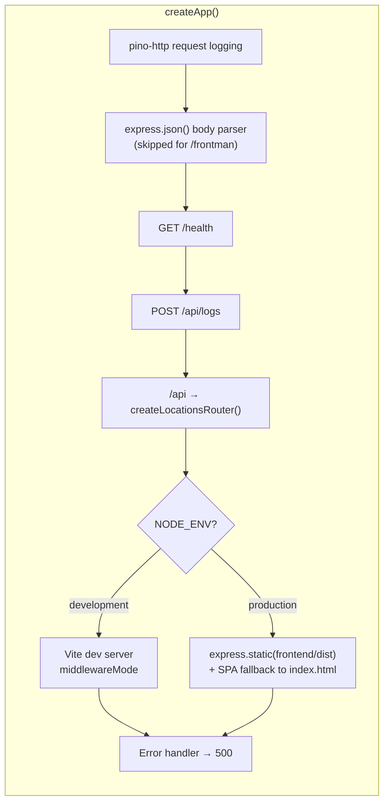
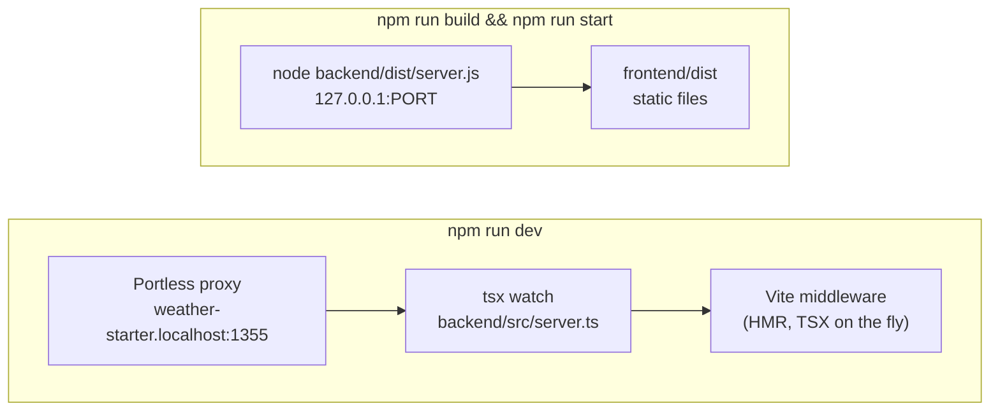
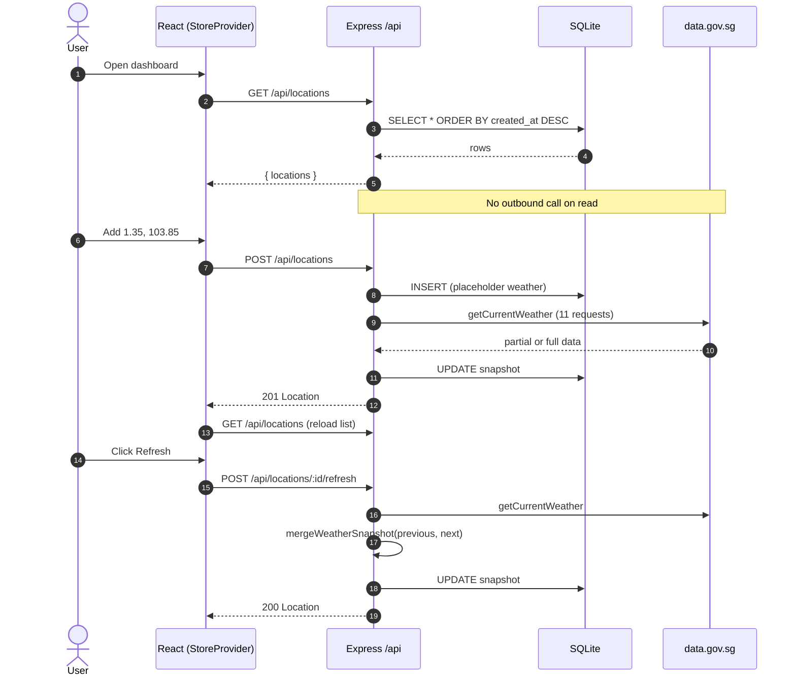

## One process, one port

The backend and frontend never run as separate servers. `createApp()` in `backend/src/server.ts` builds a single Express app that serves the API and the React app together. The frontend calls relative `/api/...` paths, so no CORS or proxy configuration is needed.

Middleware order matters. The API routes are mounted **before** the frontend handler, so `/api/*` is never swallowed by Vite or by the SPA fallback.

`createApp()` takes options so tests can build the app without side effects:

| Option                 | Default                    | Purpose                                   |
| ---------------------- | -------------------------- | ----------------------------------------- |
| `serveFrontend`        | `NODE_ENV !== 'test'`      | Mount Vite middleware or static files     |
| `enableRequestLogging` | `NODE_ENV !== 'test'`      | Attach `pino-http`                        |
| `weatherClient`        | `SingaporeWeatherClient`   | Inject a fake weather provider            |

## Development vs production

- **Development:** `scripts/dev.mjs` runs `portless run --name weather-starter tsx watch backend/src/server.ts`. Portless picks an internal port and gives you a stable `*.localhost` URL without sudo or certificate prompts. `tsx watch` restarts the server whenever backend code changes, and Vite handles frontend HMR.
- **Production:** `npm run build` writes `frontend/dist` and `backend/dist`. `scripts/start.mjs` runs the compiled server with `NODE_ENV=production`, which serves the static build and falls back to `index.html` for client-side routes.

Both scripts add `--disable-warning=ExperimentalWarning` to `NODE_OPTIONS`, because `node:sqlite` still prints an experimental warning.

## Snapshot data flow

The app does **not** call data.gov.sg on page load. Weather is fetched only when the user does something explicit, and the result is stored as a snapshot on the location's row.

Two rules keep the snapshot reliable:

1. **Creating a location never fails because the weather provider is down.** If the first fetch throws a `WeatherProviderError`, the row is still returned with `201` and the placeholder condition `Not refreshed`.
2. **A refresh never erases good data.** A field that fails to fetch keeps its previous stored value. See [Weather client](/backend/weather-client/#merging-on-refresh).

:::caution
Each location stores exactly **one** snapshot, and every refresh overwrites it. There is no readings history, so a historical chart would need a new `readings` table.
:::
