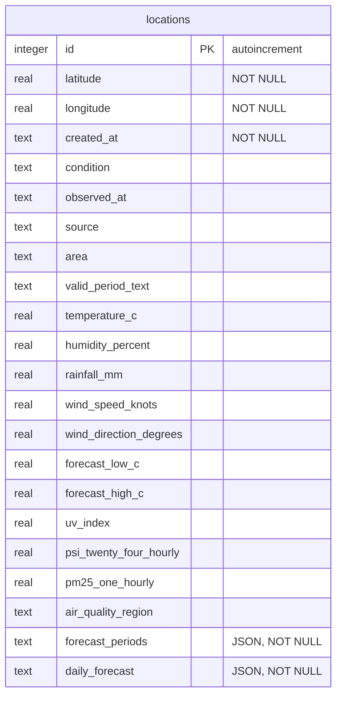
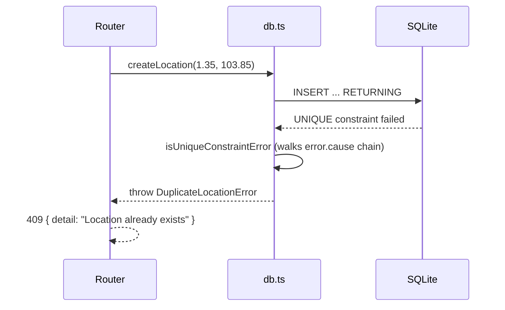

The backend stores everything in a single SQLite file, accessed through Drizzle ORM. The driver is Node's built-in `node:sqlite` (`DatabaseSync`), connected through Drizzle's `sqlite-proxy` adapter, so there is no native addon to build.

## Schema

`backend/src/schema.ts` defines one table. Each row holds a location **and** its latest weather snapshot.



- A unique index `locations_latitude_longitude_unique` on `(latitude, longitude)` blocks duplicate coordinates.
- `forecast_periods` and `daily_forecast` are JSON columns (`text` with `mode: 'json'`).
- The file runs in **WAL mode** (`PRAGMA journal_mode = WAL`), which is why `npm run reset` also deletes the `-shm` and `-wal` files.

## `db.ts` is the only data-access module

Route handlers never import Drizzle or write SQL. They call the functions in `backend/src/db.ts`:

| Function                       | Behavior                                                                    |
| ------------------------------ | --------------------------------------------------------------------------- |
| `listLocations()`              | All rows, newest first                                                      |
| `createLocation(lat, lon)`     | Inserts with the placeholder snapshot (`condition: "Not refreshed"`)        |
| `getLocation(id)`              | Row or `null`                                                               |
| `updateWeather(id, snapshot)`  | Overwrites the weather columns and returns the row, or `null` if it no longer exists |
| `deleteLocation(id)`           | `true` if a row was deleted                                                 |
| `closeDatabase()` / `resetStore()` | Test helpers                                                            |

`db.ts` also translates between the camelCase Drizzle columns and the snake_case `WeatherSnapshot` that the API returns (`weatherToColumns` and `rowToRecord`).

## Duplicate locations

`createLocation()` relies on the unique index and does no `SELECT` pre-check. Two concurrent creates of the same point can't both pass a check that doesn't exist.



Drizzle sometimes wraps the driver error, so `isUniqueConstraintError()` walks the `cause` chain instead of checking only the top-level message.

## Migrations

Migrations live in `backend/drizzle/` and are **applied automatically when the server starts**: `db.ts` runs Drizzle's `migrate()` at import time.

```bash
npm run db:generate   # write a new SQL migration from schema.ts changes
npm run db:migrate    # apply pending migrations with drizzle-kit (optional; startup does this too)
npm run reset         # delete backend/weather.db* to start fresh
```

To change the schema, edit `schema.ts`, run `db:generate`, review the generated SQL, and commit it alongside the schema change.

## Location

The default path is `backend/weather.db`, resolved from `process.cwd()`, so run commands from the repository root. Set `DATABASE_PATH` to override it. The test suite points it at a temp directory.
