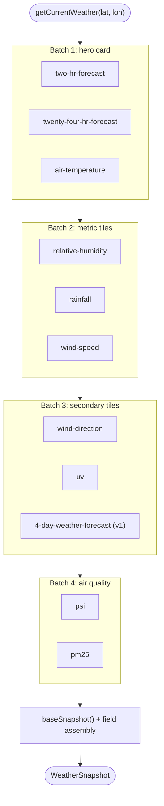
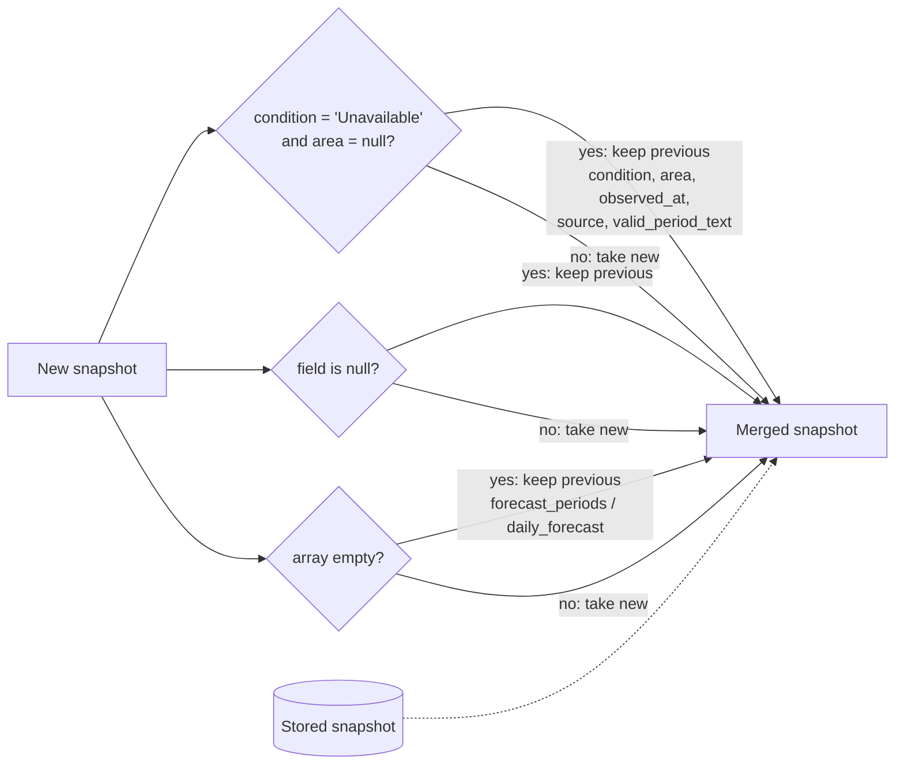

`SingaporeWeatherClient` in `backend/src/weather.ts` turns a latitude and longitude into a `WeatherSnapshot`. The router depends only on this interface:

```ts
interface WeatherClient {
  getCurrentWeather(latitude: number, longitude: number): Promise<WeatherSnapshot>;
}
```

Tests inject a fake through `createApp({ weatherClient })`.

## Batched fan-out

One `getCurrentWeather` call makes **11 upstream requests** in **four sequential batches**. The requests inside a batch run in parallel.



The ordering is deliberate. Without an API key, data.gov.sg reliably serves only about **6 requests** per refresh window. Requests beyond that return HTTP 429 and take 30–60 seconds to recover. Putting the most visible data first (condition, current temperature, and the day's high and low) means a rate-limited refresh still fills the hero card. Lower-priority tiles are the ones that come back `null`.

:::danger[Invariant]
Do not collapse the batches into a single `Promise.all`. Firing all 11 requests at once makes the hero-card data just as likely to be rate-limited as everything else.
:::

## Independent failure

Each source has its own `.catch(() => null)`, so one failing endpoint only blanks its own fields:

| Source failed            | Fields that become `null` / empty                              |
| ------------------------ | --------------------------------------------------------------- |
| `two-hr-forecast`        | `condition` → `"Unavailable"`, `area`, `observed_at`, `valid_period_text` |
| `twenty-four-hr-forecast`| `forecast_low_c`, `forecast_high_c`, `forecast_periods`         |
| a station reading        | that reading only (`temperature_c`, `rainfall_mm`, …)           |
| `uv`                     | `uv_index`                                                      |
| `4-day-weather-forecast` | `daily_forecast`                                                |
| `psi` or `pm25`          | `psi_twenty_four_hourly`, `pm25_one_hourly`, `air_quality_region` |

A malformed two-hour forecast payload (an error code, no items, or no area forecasts) is treated the same as a failed fetch. `baseSnapshot()` catches the `WeatherProviderError` and returns an empty `Unavailable` base, so the other fields are not lost.

## Retries and errors

`fetchJson()` wraps every request:

- **8-second timeout** through `AbortController` (configurable with `timeoutMs`).
- **HTTP 429** is retried up to twice, after 400 ms and then 800 ms, and then throws `Rate limit reached`. One endpoint can therefore cost up to 3 requests.
- **401 / 403** throw `rejected request (check API key)`.
- A network failure or any other non-2xx status throws a `WeatherProviderError`.
- Sends `User-Agent: weather-starter/0.1 (educational project)`, plus `x-api-key` when `WEATHER_API_KEY` is set.

## Picking the nearest value

The endpoints report data at different granularities, and the client maps a coordinate onto each one by squared Euclidean distance on lat/lon. That is accurate enough at Singapore's scale.

| Data                         | Granularity                     | Resolution                                                       |
| ---------------------------- | ------------------------------- | ---------------------------------------------------------------- |
| 2-hour forecast              | Named areas (towns)             | `nearestAreaName()` over `area_metadata`                         |
| Station readings (5 kinds)   | Weather stations                | `nearestStation()`, considering only stations **with a value** in the latest reading |
| 24-hour forecast periods     | 5 regions                       | `nearestRegionName()` over hard-coded region centroids, falling back to `central` |
| PSI / PM2.5                  | 5 regions                       | `nearestRegionName()` over `regionMetadata` from the PSI payload |
| UV index, 4-day forecast     | Island-wide                     | No lookup                                                        |

## Merging on refresh

On refresh, `mergeWeatherSnapshot()` in `routes/locations.ts` combines the new snapshot with the stored one:



:::danger[Invariant]
Do not replace the merge with a straight overwrite. A refresh that hits the rate limit would wipe values that were already known to be good.
:::

Creating a location does **not** merge, because there is no previous data. The first fetch is written as-is over the placeholder.
