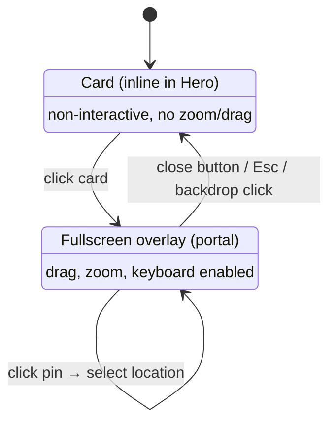
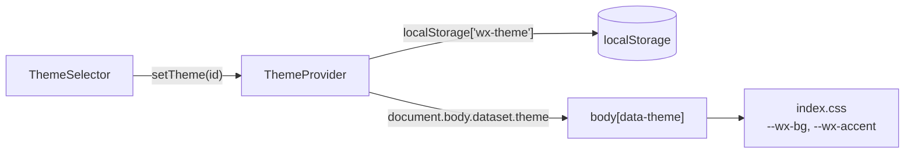

## Map card

`components/MapCard.tsx` renders the saved locations on an OpenStreetMap basemap with react-leaflet v4. The browser loads the standard (light) tiles directly from `{a,b,c}.tile.openstreetmap.org`.

:::note
A comment in `mapPins.ts` says the tiles are darkened by a CSS filter on `.wx-map .leaflet-tile-pane`, but `index.css` has no such rule. The basemap renders light, which is why `--wx-accent` has to contrast against it.
:::

Some details that are easy to break:

- **Two `MapContainer` instances, not one.** react-leaflet v4 locks every `MapContainer` prop at mount, so interaction options can't be toggled afterwards. The card and the fullscreen overlay are therefore separate maps.
- **`invalidateSize()` before `fitBounds()`.** Leaflet measures the container wrongly on first mount. `MapViewport` corrects the size first and then fits the pins.
- **Framing is keyed on coordinates, not object identity.** A refresh replaces every `Location` object. Keying on `id:lat,lon` keeps a refresh from resetting the user's view.
- **Bounds:** `SG_MAX_BOUNDS` is set slightly wider than the backend's accepted range (lat 1.1–1.5, lon 103.6–104.1), so the map never invites panning to a place where a location can't be added.
- **Pins** are `L.divIcon`s built in `components/mapPins.ts`. Each shows a condition glyph and the temperature, and the selected pin uses the theme's `--wx-accent` color.

:::caution
react-leaflet v4 works under React 18 StrictMode but not under React 19. A React 19 upgrade must move to react-leaflet v5 in the same change.
:::

The map logs `map_expanded`, `map_collapsed` and `map_pin_selected` through `logInteraction`.

CARTO's dark basemap was considered, but it now watermarks tiles requested without a key, so the app uses OSM tiles instead.

## Themes

Themes are a CSS-custom-property system driven by `body[data-theme="<id>"]`.

Each theme in `frontend/src/index.css` defines two variables:

- `--wx-bg`: the page background, a layered gradient with `background-attachment: fixed`.
- `--wx-accent`: the selected map pin's label and dot. It must contrast with the light OSM tiles.

Everything else (cards, text, borders) is a translucent white overlay such as `bg-white/[0.08]` or `border-white/15`, so it picks up the gradient automatically.

Available themes (`frontend/src/themes.ts`): **Apple** (default), Aurora, Sunset, Ocean, Forest, Midnight, Storm, Tropical Storm.

### Adding a theme

1. Add the ID to the `ThemeId` union and an entry to `THEMES` (label and swatch gradient) in `themes.ts`.
2. Add a `[data-theme='<id>']` block that defines `--wx-bg` and `--wx-accent` in `index.css`.

A light theme with dark text is **not** a quick change. The white-overlay Tailwind classes are hard-coded in every component and would all need to move to CSS variables first. See `THEMES.md` in the repo root for each theme's design notes.
