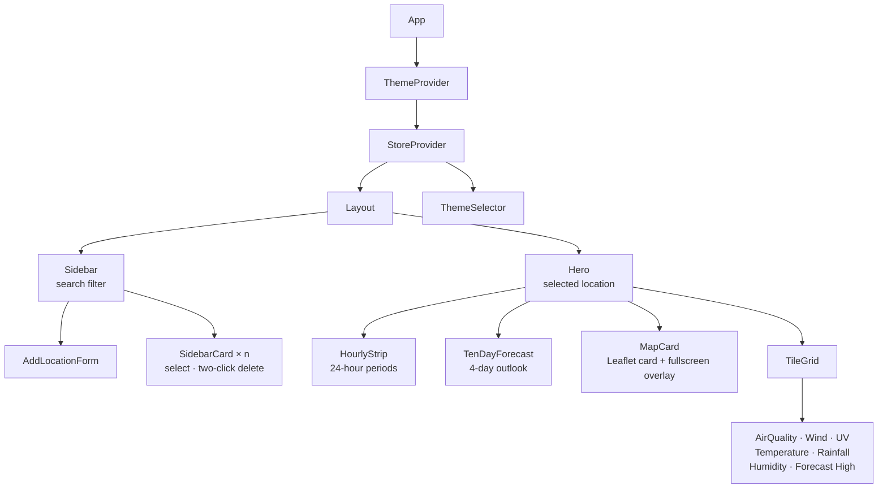
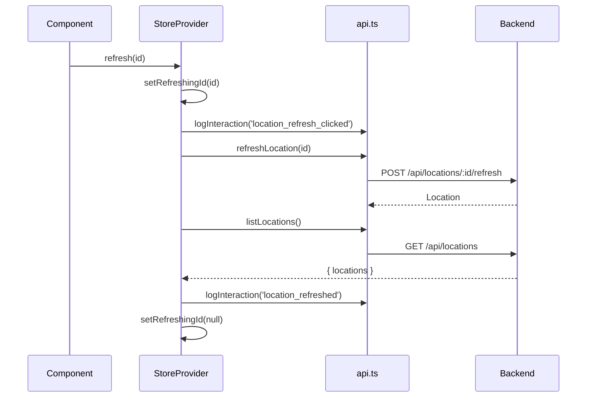

The frontend is a React 18 single-page app in `frontend/`, styled with Tailwind CSS 3. In development Vite compiles it as Express middleware, so you never start it on its own port.

## Component tree

- **Sidebar** lists the locations and filters them client-side by area or condition. The **first** location in the list (the newest) is labelled *Home*.
- **SidebarCard** deletes in two clicks. The first click arms the button, which turns red, and it disarms itself after 3 seconds.
- **Hero** shows the selected location's area, temperature, condition, high and low, and the Refresh button, along with any refresh error.

## State

There is no Redux, Zustand or React Query. State lives in two React Contexts.

### `StoreProvider` (`state/store.tsx`)

Holds the location list, the selection, in-flight flags (`isLoading`, `refreshingId`, `deletingId`), errors, and the `create`, `refresh` and `remove` actions. Every mutation follows the same pattern:

After any mutation, the store **reloads the entire list** instead of patching local state, so the UI always matches the database. If the selected location disappears, `selectedId` falls back to the first location.

Use `useStore()` for the full store, or `useSelectedLocation()` for just the selected `Location`.

### `ThemeProvider` (`state/themeStore.tsx`)

Holds the current theme ID, stores it in `localStorage` under `wx-theme`, and applies it as `document.body.dataset.theme`. See [Map and themes](/frontend/map-and-themes/).

## API layer

`frontend/src/api.ts` is the only module that calls `fetch`. Components and stores import its functions:

| Function              | Request                                |
| --------------------- | -------------------------------------- |
| `listLocations()`     | `GET /api/locations`                   |
| `createLocation(p)`   | `POST /api/locations`                  |
| `refreshLocation(id)` | `POST /api/locations/:id/refresh`      |
| `deleteLocation(id)`  | `DELETE /api/locations/:id`            |
| `logInteraction(e,m)` | `POST /api/logs` (fire-and-forget)     |

A non-2xx response throws an `Error` that carries the server's `detail` message, which the UI shows directly, for example "Coordinates must be within Singapore".

## Interaction logging

User actions go to `POST /api/logs` through `logInteraction(event, metadata)`. The call uses `keepalive: true` and swallows its own errors, so logging can never break the UI.

Event names must match `^[a-z][a-z0-9_.:-]{1,63}$` and follow a `resource_action[_state]` convention:

| Event                          | When                              |
| ------------------------------ | --------------------------------- |
| `location_form_opened`         | Add Location form opened          |
| `location_create_submitted`    | Form submitted                    |
| `location_created`             | Create succeeded                  |
| `location_create_failed`       | Create failed                     |
| `location_refresh_clicked`     | Refresh started                   |
| `location_refreshed`           | Refresh succeeded                 |
| `location_refresh_failed`      | Refresh failed                    |
| `location_delete_clicked`      | Delete confirmed                  |
| `location_deleted`             | Delete succeeded                  |
| `location_delete_failed`       | Delete failed                     |

The map adds `map_expanded`, `map_collapsed` and `map_pin_selected`.

## Formatting conventions

- A missing value is shown as `--` or `--°`, never `0`.
- Temperatures are rounded to whole degrees.
- Wind speed is stored in knots and shown in km/h (`× 1.852`).
- Times are formatted with the browser locale (`toLocaleTimeString`).
