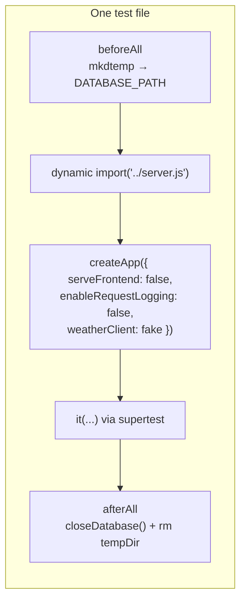

## Running tests

```bash
npm test                                                   # whole suite
npx vitest run backend/src/routes/locations.test.ts        # one file
npm run test:watch                                         # watch mode
```

`vitest.config.ts` only includes `backend/src/**/*.test.ts` and runs in the `node` environment. There is **no frontend test setup**. Frontend changes are checked with `npm run build` (which typechecks) and in the browser.

## Isolation model



- `db.ts` opens the database **when it is imported**, so a test sets `DATABASE_PATH` first and then imports `server.js` dynamically.
- Every file gets its own temporary SQLite file. Never rely on state left behind by another test file.
- `fileParallelism: false` and `pool: 'forks'` stop files from interfering with each other's environment variables.
- `NODE_ENV=test` and `LOG_LEVEL=silent` are set in the Vitest config.

## Faking the weather provider

Tests never call data.gov.sg. They inject a `weatherClient` whose behavior each test can swap:

```ts
let getCurrentWeather: () => Promise<WeatherSnapshot>;

app = await createApp({
  serveFrontend: false,
  enableRequestLogging: false,
  weatherClient: { getCurrentWeather: () => getCurrentWeather() },
});

beforeEach(() => {
  getCurrentWeather = async () => weather; // fixture
});
```

To simulate an outage or a slow provider, reassign `getCurrentWeather` inside the test. To exercise `SingaporeWeatherClient`'s own parsing, use `vi.spyOn` on its fetch methods. The malformed two-hour-forecast test does this.

## What's covered

- Creating a location stores the fetched snapshot.
- Delete, and a 404 for an unknown ID.
- A 409 for duplicates, including concurrent duplicate creates (not a 500).
- Refreshing an existing location.
- A 404 when the location is deleted during a refresh.
- `SingaporeWeatherClient` keeps the other fields when the two-hour forecast payload is malformed.

## Conventions

Tests live next to the code they cover:

```
backend/src/routes/locations.ts
backend/src/routes/locations.test.ts
```
