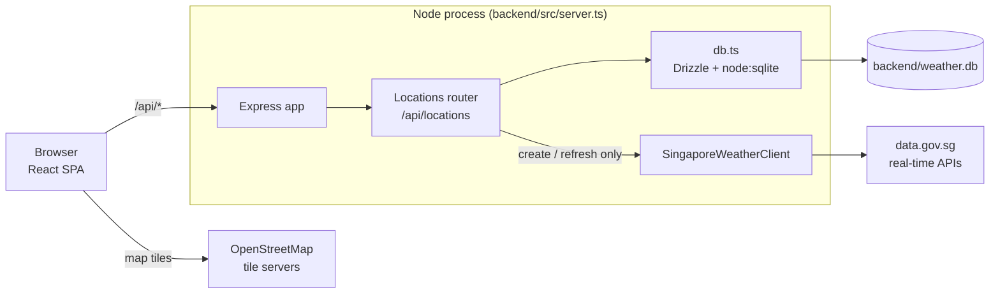

import { LinkCard, CardGrid } from '@astrojs/starlight/components';

Weather Starter is a Singapore weather dashboard. You add Singapore coordinates, and the app fetches the current conditions, forecasts, wind and air quality for each one from the public [data.gov.sg](https://data.gov.sg) real-time APIs. It stores the result in a local SQLite database.

It is a single npm-workspaces monorepo:

| Workspace   | Stack                                                     |
| ----------- | --------------------------------------------------------- |
| `backend/`  | Express 4, Drizzle ORM over `node:sqlite`, pino logging   |
| `frontend/` | React 18, Vite 7, Tailwind CSS 3, Leaflet / react-leaflet |
| `docs/`     | This Astro Starlight site                                 |

## System at a glance

The browser only talks to the Express server, apart from map tiles, which it loads straight from OpenStreetMap. The server calls data.gov.sg only when a location is **created** or **refreshed**. Every read is served from the stored snapshot.

## Where to go next

<CardGrid>
  <LinkCard title="Getting started" href="/getting-started/" description="Install, run, and the npm scripts." />
  <LinkCard title="Architecture" href="/architecture/overview/" description="Process model, dev vs production, and the snapshot data flow." />
  <LinkCard title="Backend" href="/backend/api/" description="HTTP API, weather client, and database." />
  <LinkCard title="Frontend" href="/frontend/overview/" description="Component tree, state stores, map, and themes." />
</CardGrid>
